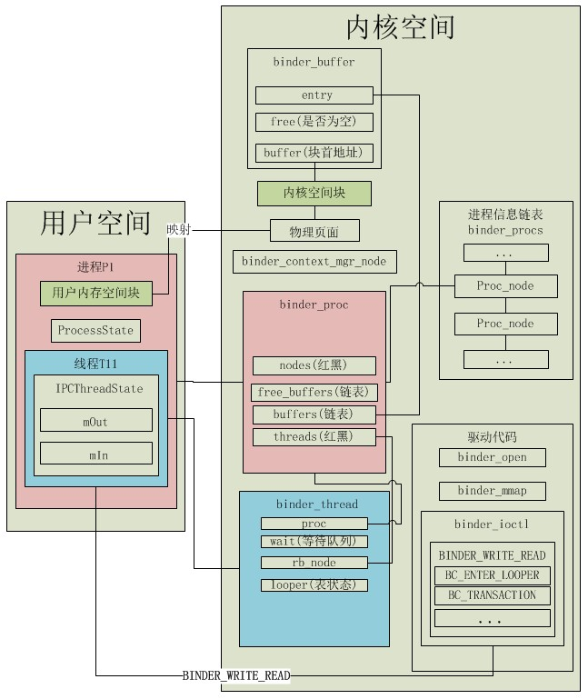

## Android Binder设计与实现 - 实现篇 ##

### 前言 ###

 在学习Android的Binder机制时，看了设计篇这篇文章（读本文前最好读一下），觉得写得非常棒，可惜只有设计篇，都几年了还没有实现篇，就想尝试完成这个工作，虽然可能没有[universus](http://my.csdn.net/universus)写得那么好，但也希望能对同在学习Android的Binder机制的人有所帮助。同时如果文中如果有什么理解错误请及时指出，欢迎大家交流。

### 1、概述 ###

Android中基于binder的IPC，其本质都是通过文件操作与binder驱动交互实现的。在通信过程中，每个参与通信的进程都会在内核存在对应的数据，这些数据是进程在和驱动打交道，如执行fopen或者ioctl时，由binder驱动创建与维护。当然，与binder驱动直接交互实现IPC比较麻烦，故Android帮我们封装成了Binder Adapter，主要包括IPCThreadState和ProcessState相关的部分。我们平时的Service都是通过Binder Adapter层间接操作驱动的。我们首先抛开Binder Adapter层，看直接与binder驱动交互需要怎么做，然后在这个基础上分析Android是怎么通过Binder Adapter层帮我们封装的。

同时，我们说binder通信是一种支持CS架构的IPC，是因为binder从驱动级别就保存有一个进程是否处于循环监听状态，因为CS架构的基本逻辑就是Server处于循环监听状态，等待Client的请求并响应其请求，另外在Binder中还有类似于“会话”的概念，实现同步通信，在驱动层对一次会话进行了支持，这也是一种对CS架构的支持。

当然，我们还得意识到，Android的binder机制在应用层看到到的是RPC机制，即应用层的业务逻辑已经与IPC绑定了，要在IPC的基础上实现RPC，那么在客户端调用远程方法后，Binder机制会将该方法转换为对应的约定编号，再加上参数，作为IPC传递的内容，服务器端收到IPC消息后，将获取函数参数，同时按约定将编号转化为对应的服务端方法的调用，然后再将调用方法的结果转化为IPC的通信内容，然后传递给客户端，从而实现RPC。

到了RPC层其实就和每个Service的业务逻辑挂钩了，我们先抛开业务逻辑，只关注IPC通信的过程，看看底层数据是怎么通过binder驱动传递的，然后在我们搞清楚这写机制以后，再看Android是如何在IPC通信的基础上实现RPC的。

我们可以将网络七层协议模型或者TCP/IP参考模型部分与这里的Binder机制进行对比理解，我们可以认为共享内存实现了物理层，从物理上解决传输问题；而通过binder_node实现了网络层，handle就好比IP地址，通过handle来从客户端进程找到对应的服务端进程，就好比从一个IP发数据包然后找到对应的目的IP，当然，由于客户端直接记住IP地址有困难，就发明了DNS，查询URL转换为IP地址来访问，而binder中ServiceManager就是DNS服务器，实现服务名称到对应handle的转换，再往上就是RPC调用逻辑了，这就与网络模型中的应用层对应了，实现了一个具体服务的远程调用。（这部分如果看起来有困难可以在阅读完本文再返回回来阅读）
### 2、binder相关的内存模型 ###


如图1，每个使用Binder的进程，在内核空间中都存在binder_proc、binder_buffer资源，每个线程还存在个binder_thread与之对应，进程中会存在binder通信使用的用户内存空间块，它将与该进程对应的binder_buffer映射同一块内存（对binder设备的fd执行mmap函数就能完成这个共享内存的映射），这就是Binder通信只拷贝一次的根本原因。binder_proc和binder_thread分别保存对应的进程、线程相关的信息。

  另外解释一下几个概念：

用户空间的binder实体：就是继承了IBinder类的那些子类的对象，如AudioFlinger类型的对象、MediaPlayerService类型的对象；

我们可以认为上图的内核空间中，驱动代码属于代码段，其余部分属于数据段，而用户空间进程通过系统调用调用驱动代码来操作数据段中的内容。

### 3、直接与Binder驱动交互实现IPC ###

#### 3.1、ServiceManager需要进行的操作 ####

```cpp
  //打开binder设备
1、 bs->fd = open("/dev/binder", O_RDWR);//bs定义struct binder_state *bs;
    //进行内存映射
2、 bs->mapped = mmap(NULL, mapsize, PROT_READ, MAP_PRIVATE, bs->fd, 0);
    //设置本进程为ServiceManager进程
3、 ioctl(bs->fd, BINDER_SET_CONTEXT_MGR, 0);
    unsigned readbuf[N];//在本用户进程空间开辟一段内存
    //将BC_ENTER_LOOPER填充至bwr
    readbuf[0] = BC_ENTER_LOOPER;
    bwr.write_buffer = readbuf;
    //通知binder驱动本线程进入循环等待的loop状态，线程对应的binder_thread中的looper值也对应改变
4、 ioctl(bs->fd, BINDER_WRITE_READ, &bwr);//bwr为binder_write_read类型，装载的命令为BC_ENTER_LOOPER
    //进入循环，等待读binder消息，当有消息读到时，解析readbuf中返回的结果
    for (;;) { 
        bwr.read_size = sizeof(readbuf); //需要读的大小 
        bwr.read_consumed = 0;  
        bwr.read_buffer = (unsigned) readbuf; //将进程内存空间传过去
5、     ioctl(bs->fd, BINDER_WRITE_READ, &bwr); //操作驱动读取消息
        //解析readbuf中返回的结果
        uint32_t cmd = *readbuf++;
        switch(cmd) {//判断结果中的命令类型
        ...
        case BR_TRANSACTION: {//处理其中的结果
            //关键的关键：readbuf后面的数据中包含一个进程内存空间的指针，
            //它是与本进程通信的那个远端进程传过来的数据在本进程对应的内核内存空间的地址，进行转换得到，
            //转换是在kernel的drivers/staging/android/binder.c中：
            //tr.data.ptr.buffer = (void *)t->buffer->data + proc->user_buffer_offset;
            //其中user_buffer_offset是在建立进程的binder_proc时计算出的内核空间地址与本用户进程空间地址的偏移量
            ...
        }
        ...
        }
    }
```
没错，本质上我们就只需要执行上面的5个步骤就可以使ServiceManager跑起来，下面说一下每个步骤执行后的结果：

1语句执行后，内核中将创建本进程对应的创建对应binder_proc；

2语句执行后，将创建本进程在内核中使用的buffer，即上面内核模型中的内核空间块，同时将其映射到用户内存空间块；

3语句执行后，由于是第一次调用ioctl，在执行binder_get_thread(proc)语句时，将为本线程创建对应的binder_thread结构体保存在内核，同时binder驱动将为ServiceManager建立 binder_node对象；并将binder_node赋值给binder_context_mgr_node，同时记住进程的PID，从而设置其为binder的ServiceManager进程；

4语句执行后，binder驱动将获知本进程已经进入循环监听等待状态，binder驱动中对应的线程信息结构体的表线程状态的looper变量也对应修改；

5语句就是ServiceManager进入循环，不断监听客户端的请求，没有请求时ioctl将阻塞，有请求到达是就分析请求类型，做出相应的处理。

#### 3.2、普通Service需要进行的操作 ####

```cpp
  fd = open("/dev/binder", O_RDWR);//打开Binder驱动
  //binder驱动将返回本驱动的版本号，由于是第一次调用ioctl，在执行binder_get_thread(proc)语句时，将为本线程创建对应的binder_thread结构体保存在内核
  ioctl(fd, BINDER_VERSION, &vers); 
  //通知binder驱动本服务最多可同时启动接收binder消息的线程数
  ioctl(fd, BINDER_SET_MAX_THREADS, &maxThreads);
  //进行内存映射
  bs->mapped = mmap(NULL, mapsize, PROT_READ, MAP_PRIVATE, bs->fd, 0);
  //接下来就可以通过往bwr中填入一定的内容实现与其他进程的通信了
  //这个地方是作为客户端向ServiceManager注册服务，下面将详细分析这里传输的bwr
  构造注册到ServiceManager的binder_write_read的数据结构变量bwr
  ...
  ioctl(mProcess->mDriverFD, BINDER_WRITE_READ, &bwr);
  //读取结果
  while(true){//刚才的一次写操作会出发多次读操作
  	ioctl(mProcess->mDriverFD, BINDER_WRITE_READ, &bwr);
  }
```

 bwr就是用户进程向binder驱动传递的数据，此处的bwr内容如下图2所示：（bwr的内容是通过读取源码时总结出来的，就没贴出分析源码的过程了，有兴趣的可以结合图2分析bwr的构建过程，这样会更容易阅读）


bwr中的write_buffer指向mOut包装的结构，而mOut的buffer将指向真正传递的数据，而本次ioctl的目的是注册服务，所以本次传递的有效数据中包含了一个flat_binder_object类型对象(图中画了两个flat_binder_object是为了便于理解offsets的概念)，它是用户进程中的待注册的Service的类型（它是继承自BBinder），即BBinder类型的对象，而如果IPC传递的实际数据内容中包含binder对象时，binder驱动需要知道数据中包含binder对象，并在驱动中将这个binder对象做一些处理，而接收进程接收到的binder对象就是被驱动修改后，在接收进程中也可以使用的binder。

5语句执行后：

（1）首先，由于传入内核的bwr的有效负载数据中，存在bind实体的封装flat_binder_object对象，内核驱动会拿出这个flat_binder_object对象，然后以flat_binder_object对象的binder成员值（为客户端实体类型的指针类型，如AudioFlinger对象指针）查找本进程对应的内核数据结构binder_proc中的nodes红黑树，查找不到就为binder实体创建对应的内核数据结构binder_node，我们这里记它为snode，并找到ServiceManager的binder_node节点binder_context_mgr_node，在其中建立snode的引用。然后驱动会在内核中创建一个binder_transaction类型的事务，填充数据目标进程相关信息等，将binder_transaction的binder_work类型成员变量work（work.type=BINDER_WORK_TRANSACTION）加入到ServiceManager的todo队列，让ServiceManager去处理，这样会唤醒正在读等待的ServiceManager，而本进程会执行6语句，进入休眠状态等待ServiceManager的回复。

（2）ServiceManager就会从其binder_proc结构的todo队列中读取刚才放进去的binder_work，并由这个成员变量找到binder_transaction事务类型变量(记为t)，然后创建binder_transaction_data类型变量(记为tr)，填充t的内容到tr中，这个过程中也会将t中的指向内核数据的指针转换为tr中指向ServiceManager进程的用户空间的指针(tr.data.ptr.buffer = (void *)t->buffer->data + proc->user_buffer_offset)，然后在内核创建的bwr的read_buffer中先填入BR_TRANSACTION这个cmd，再填入tr部分，另外这个地方还会把t压入ServiceManager本线程binder_thread的transaction_stack的栈顶，以等待用户空间的代码处理完毕后向返回驱动结果。然后返回ioctl处，将内核的bwr拷贝回用户空间，将ServiceManager的线程的looper的BINDER_LOOPER_STATE_NEED_RETURN标准去掉，然后就返回到用户空间的binder_loop的调用ioctrl处。后面就是在ServiceManager的用户空间中处理业务逻辑相关的问题了。ServiceManager会将服务端传过来的Binder实体的封装flat_binder_object的相关信息写到一个struct svcinfo结构体中，包括它的名称和句柄值等，然后插入到ServiceManager维护的svclist链表中去。

 到第5步时，我们做的操作应该和普通客户端调用服务器端的操作是相同的，我们构造了BBinder的子类对象，即本服务对应的实现（如MediaService的实现就是MediaPlayerService类）类的对象加入到bwr中，同时bwr中的加入类型为BINDER_TYPE_BINDER的命令，当然，这个对象的载体是flat_binder_object类型对象，同时handle值也会被包装传入至binder驱动中去，binder驱动将根据这个handle值找到内核空间对应的binder_node对象，而这个对象保存了对应服务端的进程信息，这样，就找到了对应服务端的进程信息，找到服务端在内存中拥有的内核空间块，然后将客户端传来的数据拷贝到这个内核空间块，而由于服务端处于循环监听的阻塞状态，这时它就将停止阻塞，按照前面说的将内核内存块对应的地址转换为对应用户空间服务端进程内存地址(tr.data.ptr.buffer = (void *)t->buffer->data + proc->user_buffer_offset，即内核空间地址+内核空间地址与用户空间地址的偏移量)，并将其作为参数返回用户空间的服务进程，服务进程根据返回参数读取刚才从另一个进程拷贝进来内核空间的那部分数据，这就实现了IPC。

这里是服务端作为ServiceManager的客户端，通过IPC向ServiceManager发送注册服务请求，让ServiceManager帮这个服务端记住它在binder驱动拥有的binder_node的handle值，而其他客户端想访问本服务端时，就先通过IPC向ServiceManager查询需要服务的handle值，然后拿着这个handle值传入binder驱动，binder驱动再根据handle值查询对应服务器进程信息，拷贝对应信息到服务进程的内核内存块，完成传递。

整个传递过程可以描述为图3所示，可以结合图2理解：

图3 客户端使用BC_TRANSACTION命令向服务端传数据的过程


需要注意的是，图中的两个binder_transaction结构是一个对象，其余的同颜色的都只是一个类型，是不同的两个对象。

