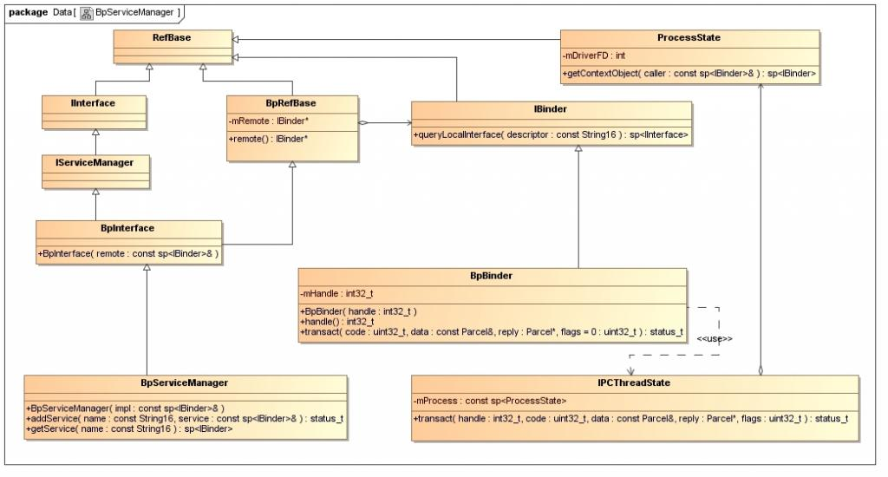

## 浅谈Android系统进程间通信（IPC）机制Binder中的Server和Client获得Service Manager接口之路 ##

我们知道，Service Manager在Binder机制中既充当守护进程的角色，同时它也充当着Server角色，然而它又与一般的Server不一样。对于普通的Server来说，Client如果想要获得Server的远程接口，那么必须通过Service Manager远程接口提供的getService接口来获得，这本身就是一个使用Binder机制来进行进程间通信的过程。而对于Service Manager这个Server来说，Client如果想要获得Service Manager远程接口，却不必通过进程间通信机制来获得，因为Service Manager远程接口是一个特殊的Binder引用，它的引用句柄一定是0。

获取Service Manager远程接口的函数是defaultServiceManager，这个函数声明在frameworks/base/include/binder/IServiceManager.h文件中：

```cpp
sp<IServiceManager> defaultServiceManager();  
```

实现在frameworks/base/libs/binder/IServiceManager.cpp文件中：

```cpp
sp<IServiceManager> defaultServiceManager()  
{  
  
    if (gDefaultServiceManager != NULL) return gDefaultServiceManager;  
  
    {  
        AutoMutex _l(gDefaultServiceManagerLock);  
        if (gDefaultServiceManager == NULL) {  
            gDefaultServiceManager = interface_cast<IServiceManager>(  
                ProcessState::self()->getContextObject(NULL));  
        }  
    }  
  
    return gDefaultServiceManager;  
}  
```
gDefaultServiceManagerLock和gDefaultServiceManager是全局变量，定义在frameworks/base/libs/binder/Static.cpp文件中：

```cpp
Mutex gDefaultServiceManagerLock;  
sp<IServiceManager> gDefaultServiceManager;  
```
从这个函数可以看出，gDefaultServiceManager是单例模式，调用defaultServiceManager函数时，如果gDefaultServiceManager已经创建，则直接返回，否则通过interface_cast<IServiceManager>(ProcessState::self()->getContextObject(NULL))来创建一个，并保存在gDefaultServiceManager全局变量中。
在继续介绍interface_cast<IServiceManager>(ProcessState::self()->getContextObject(NULL))的实现之前，先来看一个类图，这能够帮助我们了解Service Manager远程接口的创建过程。



参考资料Android深入浅出之Binder机制一文的读者，应该会比较容易理解这个图。这个图表明了，BpServiceManager类继承了`BpInterface<IServiceManager>`类，BpInterface是一个模板类，它定义在frameworks/base/include/binder/IInterface.h文件中：
```cpp
template<typename INTERFACE>  
class BpInterface : public INTERFACE, public BpRefBase  
{  
public:  
    BpInterface(const sp<IBinder>& remote);  
  
protected:  
    virtual IBinder* onAsBinder();  
};  
```
IServiceManager类继承了IInterface类，而IInterface类和BpRefBase类又分别继承了RefBase类。在BpRefBase类中，有一个成员变量mRemote，它的类型是IBinder*，实现类为BpBinder，它表示一个Binder引用，引用句柄值保存在BpBinder类的mHandle成员变量中。BpBinder类通过IPCThreadState类来和Binder驱动程序并互，而IPCThreadState又通过它的成员变量mProcess来打开/dev/binder设备文件，mProcess成员变量的类型为ProcessState。ProcessState类打开设备/dev/binder之后，将打开文件描述符保存在mDriverFD成员变量中，以供后续使用。

理解了这些概念之后，就可以继续分析创建Service Manager远程接口的过程了，最终目的是要创建一个BpServiceManager实例，并且返回它的IServiceManager接口。创建Service Manager远程接口主要是下面语句：

```cpp

gDefaultServiceManager = interface_cast<IServiceManager>(  
    ProcessState::self()->getContextObject(NULL));  
```
 看起来简短，却暗藏玄机，具体可阅读Android深入浅出之Binder机制这篇参考资料，这里作简要描述。
首先是调用ProcessState::self函数，self函数是ProcessState的静态成员函数，它的作用是返回一个全局唯一的ProcessState实例变量，就是单例模式了，这个变量名为gProcess。如果gProcess尚未创建，就会执行创建操作，在ProcessState的构造函数中，会通过open文件操作函数打开设备文件/dev/binder，并且返回来的设备文件描述符保存在成员变量mDriverFD中。

接着调用gProcess->getContextObject函数来获得一个句柄值为0的Binder引用，即BpBinder了，于是创建Service Manager远程接口的语句可以简化为：
```cpp
gDefaultServiceManager = interface_cast<IServiceManager>(new BpBinder(0));  
```
再来看函数`interface_cast<IServiceManager>`的实现，它是一个模板函数，定义在framework/base/include/binder/IInterface.h文件中：
```cpp
template<typename INTERFACE>  
inline sp<INTERFACE> interface_cast(const sp<IBinder>& obj)  
{  
    return INTERFACE::asInterface(obj);  
}  
```

这里的INTERFACE是IServiceManager，于是调用了IServiceManager::asInterface函数。`IServiceManager::asInterface`是通过`DECLARE_META_INTERFACE(ServiceManager)`宏在IServiceManager类中声明的，它位于framework/base/include/binder/IServiceManager.h文件中：
```cpp
DECLARE_META_INTERFACE(ServiceManager);  
```

展开即为：
```cpp
#define DECLARE_META_INTERFACE(ServiceManager)                              \  
    static const android::String16 descriptor;                          \  
    static android::sp<IServiceManager> asInterface(                    \  
    const android::sp<android::IBinder>& obj);                          \  
    virtual const android::String16& getInterfaceDescriptor() const;    \  
    IServiceManager();                                                  \  
    virtual ~IServiceManager();    
    
```

`IServiceManager::asInterface`的实现是通过`IMPLEMENT_META_INTERFACE(ServiceManager, "android.os.IServiceManager")`宏定义的，它位于framework/base/libs/binder/IServiceManager.cpp文件中：

```cpp
IMPLEMENT_META_INTERFACE(ServiceManager, "android.os.IServiceManager");  
```
展开即为：
```cpp
#define IMPLEMENT_META_INTERFACE(ServiceManager, "android.os.IServiceManager")                 \  
    const android::String16 IServiceManager::descriptor("android.os.IServiceManager");     \  
    const android::String16&                                   \  
    IServiceManager::getInterfaceDescriptor() const {                                      \  
    return IServiceManager::descriptor;                                                    \  
    }                                                                                      \  
    android::sp<IServiceManager> IServiceManager::asInterface(                             \  
    const android::sp<android::IBinder>& obj)                                              \  
    {                                                                                      \  
    android::sp<IServiceManager> intr;                                                     \  
    if (obj != NULL) {                                                                     \  
    intr = static_cast<IServiceManager*>(                                                  \  
    obj->queryLocalInterface(                                                              \  
    IServiceManager::descriptor).get());                                                   \  
    if (intr == NULL) {                                                                    \  
    intr = new BpServiceManager(obj);                                                      \  
    }                                                                                      \  
    }                                                                                      \  
    return intr;                                                                           \  
    }                                                                                      \  
    IServiceManager::IServiceManager() { }                                                 \  
    IServiceManager::~IServiceManager() { }        
```

估计写这段代码的员工是从Microsoft跳槽到Google的。这里我们关注IServiceManager::asInterface的实现：
```cpp
android::sp<IServiceManager> IServiceManager::asInterface(const android::sp<android::IBinder>& obj)                                                
{                                                                                       
    android::sp<IServiceManager> intr;                                                      
      
    if (obj != NULL) {                                                                       
        intr = static_cast<IServiceManager*>(                                                    
                    obj->queryLocalInterface(IServiceManager::descriptor).get());  
          
        if (intr == NULL) {                  
            intr = new BpServiceManager(obj);                                          
        }                                            
    ｝  
    return intr;                                    
}     
```
这里传进来的参数obj就则刚才创建的`new BpBinder(0)`了，BpBinder类中的成员函数queryLocalInterface继承自基类IBinder，`IBinder::queryLocalInterface`函数位于framework/base/libs/binder/Binder.cpp文件中：
```cpp
sp<IInterface>  IBinder::queryLocalInterface(const String16& descriptor)  
{  
    return NULL;  
}  
```

由此可见，在IServiceManager::asInterface函数中，最终会调用下面语句：
```cpp
intr = new BpServiceManager(obj);   
```
即为：
```cpp
intr = new BpServiceManager(new BpBinder(0));  
```
回到defaultServiceManager函数中，最终结果为：
```cpp
gDefaultServiceManager = new BpServiceManager(new BpBinder(0));  
```

这样，Service Manager远程接口就创建完成了，它本质上是一个BpServiceManager，包含了一个句柄值为0的Binder引用。

在Android系统的Binder机制中，Server和Client拿到这个Service Manager远程接口之后怎么用呢？

对Server来说，就是调用IServiceManager::addService这个接口来和Binder驱动程序交互了，即调用BpServiceManager::addService 。而BpServiceManager::addService又会调用通过其基类BpRefBase的成员函数remote获得原先创建的BpBinder实例，接着调用BpBinder::transact成员函数。在BpBinder::transact函数中，又会调用IPCThreadState::transact成员函数，这里就是最终与Binder驱动程序交互的地方了。回忆一下前面的类图，IPCThreadState有一个PorcessState类型的成中变量mProcess，而mProcess有一个成员变量mDriverFD，它是设备文件/dev/binder的打开文件描述符，因此，IPCThreadState就相当于间接在拥有了设备文件/dev/binder的打开文件描述符，于是，便可以与Binder驱动程序交互了。

对Client来说，就是调用IServiceManager::getService这个接口来和Binder驱动程序交互了。具体过程上述Server使用Service Manager的方法是一样的，这里就不再累述了。

 IServiceManager::addService和IServiceManager::getService这两个函数的具体实现，在下面两篇文章中，会深入到Binder驱动程序这一层，进行详细的源代码分析，以便更好地理解Binder进程间通信机制，敬请关注。


