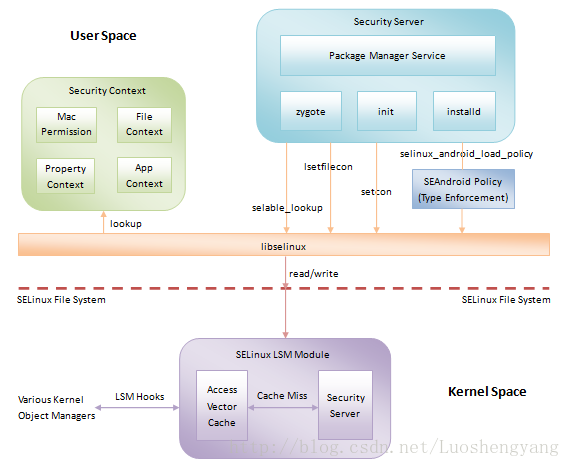
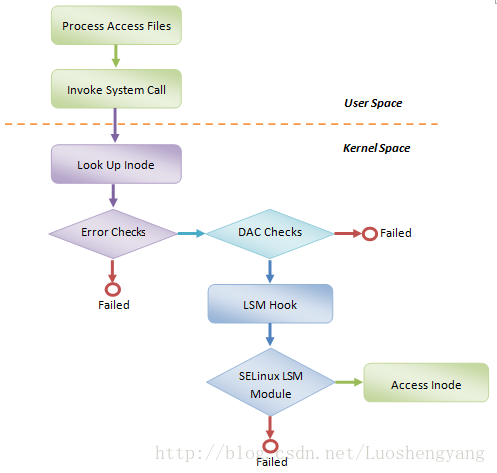
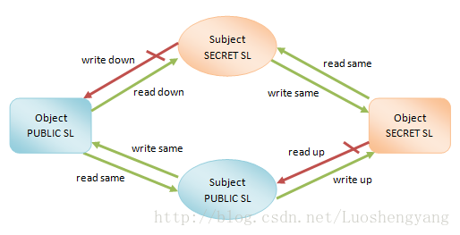

## SEAndroid安全机制框架分析 ##

SEAndroid安全机制所要保护的对象是系统中的资源，这些资源分布在各个子系统中，例如我们经常接触的文件就是分布文件子系统中的。实际上，系统中需要保护的资源非常多，除了前面说的文件之外，还有进程、socket和IPC等等。对于Android系统来说，由于使用了与传统Linux系统不一样的用户空间运行时，即应用程序运行时框架，因此它在用户空间有一些特有的资源是需要特别保护的，例如系统属性的设置。

接下来，我们就通过图1来观察SEAndroid安全机制的整体框架，如下所示：



从图1可以看到，以SELinux文件系统接口为边界，SEAndroid安全机制包含有内核空间和用户空间两部分支持。在内核空间，主要涉及到一个称为SELinux LSM的模块。而在用户空间中，涉及到Security Context、Security Server和SEAndroid Policy等模块。这些内核空间模块和用户空间模块的作用以及交互如下所示：

1. 内核空间的SELinux LSM模块负责内核资源的安全访问控制。
2. 用户空间的SEAndroid Policy描述的是资源安全访问策略。系统在启动的时候，用户空间的Security Server需要将这些安全访问策略加载内核空间的SELinux LSM模块中去。这是通过SELinux文件系统接口实现的。


3. 用户空间的Security Context描述的是资源安全上下文。SEAndroid的安全访问策略就是在资源的安全上下文基础上实现的。

4. 用户空间的Security Server一方面需要到用户空间的Security Context去检索对象的安全上下文，另一方面也需要到内核空间去操作对象的安全上下文。

5. 用户空间的selinux库封装了对SELinux文件系统接口的读写操作。用户空间的Security Server访问内核空间的SELinux LSM模块时，都是间接地通过selinux进行的。这样可以将对SELinux文件系统接口的读写操作封装成更有意义的函数调用。

6. 用户空间的Security Server到用户空间的Security Context去检索对象的安全上下文时，同样也是通过selinux库来进行的。


接下来，我们就从内核空间和用户空间两个角度来分析SEAndroid安全机制框架。
一. 内核空间

在内核空间中，存在一个SELinux LSM模块，这个模块包含有一个访问向量缓冲（Access Vector Cache）和一个安全服务（Security Server）。Security Server负责安全访问控制逻辑，即由它来决定一个主体访问一个客体是否是合法的。这里说的主体一般就是指进程，而客体就是主体要访问的资源，例如文件。

与SELinux Security Server相关的一个内核子模块是LSM，全称是Linux Security Model。LSM可以说是为了SELinux而设计的，但是它是一个通用的安全模块，SELinux可以使用，其它的模块也同样可以使用。这体现了Linux内核模块的一个重要设计思想，只提供机制实现而不提供策略实现。在我们这个例子中，LSM实现的就是机制，而SELinux就是在这套机制下的一个策略实现。也就是说，你也可以通过LSM来实现自己的一套MAC安全机制。

SELinux、LSM和内核中的子系统是如何交互的呢？首先，SELinux会在LSM中注册相应的回调函数。其次，LSM会在相应的内核对象子系统中会加入一些Hook代码。例如，我们调用系统接口read函数来读取一个文件的时候，就会进入到内核的文件子系统中。在文件子系统中负责读取文件函数vfs_read就会调用LSM加入的Hook代码。这些Hook代码就会调用之前SELinux注册进来的回调函数，以便后者可以进行安全检查。

SELinux在进行安全检查的时候，首先是看一下自己的Access Vector Cache是否已经有结果。如果有的话，就直接将结果返回给相应的内核子系统就可以了。如果没有的话，就需要到Security Server中去进行检查。检查出来的结果在返回给相应的内核子系统的同时，也会保存在自己的Access Vector Cache中，以便下次可以快速地得到检查结果。

上面描述的安全访问控制流程可以通过图2来总结，如下所示：

图2 SELinux安全访问控制流程

从图2可以看到，内核中的资源在访问的过程中，一般需要获得三次检查通过：

1. 一般性错误检查，例如访问的对象是否存在、访问参数是否正确等。
2. DAC检查，即基于Linux UID/GID的安全检查。
3. SELinux检查，即基于安全上下文和安全策略的安全检查。

二. 用户空间

在用户空间中，SEAndroid包含有三个主要的模块，分别是安全上下文（Security Context）、安全策略（SEAndroid Policy）和安全服务（Security Server）。接下来我们就分别对它们进行描述。

1. 安全上下文

SEAndroid是一种基于安全策略的MAC安全机制。这种安全策略又是建立在对象的安全上下文的基础上的。这里所说的对象分为两种类型，一种称主体（Subject），一种称为客体（Object）。主体通常就是指进程，而客观就是指进程所要访问的资源，例如文件、系统属性等。

安全上下文实际上就是一个附加在对象上的标签（Tag）。这个标签实际上就是一个字符串，它由四部分内容组成，分别是SELinux用户、SELinux角色、类型、安全级别，每一个部分都通过一个冒号来分隔，格式`user:role:type:sensitivity`。

例如，在开启了SEAndroid安全机制的设备上执行带-Z选项的ls命令，就可以看到一个文件的安全上下文：
```bash
$ ls -Z /init.rc  
-rwxr-x--- root     root     u:object_r:rootfs:s0 init.rc  
```
上面的命令列出文件/init.rc的安全上下文为`u:object_r:rootfs:s0`，这表明文件/init.rc的SELinux用户、SELinux角色、类型和安全级别分别为u、object_r、rootfs和s0。

又如，在开启了SEAndroid安全机制的设备上执行带-Z选项的ps命令，就可以看到一个进程的安全上下文：
```bash
$ ps -Z  
LABEL                          USER     PID   PPID  NAME  
u:r:init:s0                    root      1     0     /init  
......  
```
上面的命令列出进程init的安全上下文为`u:r:init:s0`，这表明进程init的SELinux用户、SELinux角色、类型和安全级别分别为u、r、init和s0。

在安全上下文中，只有类型（Type）才是最重要的，SELinux用户、SELinux角色和安全级别都几乎可以忽略不计的。正因为如此，SEAndroid安全机制又称为是基于TE（Type Enforcement）策略的安全机制。不过为了方便理解安全上下文，接下来我们还是简单地对SELinux用户、SELinux角色和安全级别的作用进行介绍。

对于进程来说，SELinux用户和SELinux角色只是用来限制进程可以标注的类型。而对于文件来说，SELinux用户和SELinux角色就可以完全忽略不计。为了完整地描述一个文件的安全上下文，通常将它的SELinux角色固定为object_r，而将它的SELinux用户设置为创建它的进程的SELinux用户。

在SEAndroid中，只定义了一个SELinux用户u，因此我们通过ps -Z和ls -Z命令看到的所有的进程和文件的安全上下文中的SELinux用户都为u。同时，SEAndroid也只定义了一个SELinux角色r，因此，我们通过ps -Z命令看到的所有进程的安全上下文中的SELinux角色都为r。

通过external/sepolicy/users和external/sepolicy/roles文件的内容，我们就可以看到SEAndroid所定义的SELinux用户和SELinux角色。

文件external/sepolicy/users的内容如下所示：

```bash
user u roles { r } level s0 range s0 - mls_systemhigh;  
```

上述语句声明了一个SELinux用户u，它可用的SELinux角色为r，它的默认安全级别为s0，可用的安全级别范围为s0~mls_systemhigh，其中，mls_systemhigh为系统定义的最高安全级别。

文件external/sepolicy/roles的内容如下所示：

```c
role r;  
role r types domain;
```

第一个语句声明了一个SELinux角色r；第二个语句允许SELinux角色r与类型domain关联。

上面提到，对于进程来说，SELinux用户和SELinux角色只是用来限制进程可以标注的类型，这是如何体现的呢？以前面列出的external/sepolicy/users和external/sepolicy/roles文件内容为例，如果没有出现其它的user或者role声明，那么就意味着只有u、r和domain可以组合在一起形成一个合法的安全上下文，而其它形式的安全上下文定义均是非法的。

读者可能注意到，前面我们通过ps -Z命令看到进程init的安全上下文为`u:r:init:s0`，按照上面的分析，这是不是一个非法的安全上下文呢？答案是否定的，因为在另外一个文件external/sepolicy/init.te中，通过type语句声明了类型init，并且将domain设置为类型init的属性，如下所示：

```c
type init, domain;  
```

由于init具有属性domain，因此它就可以像domain一样，可以和SELinux用户u和SELinux角色组合在一起形成合法的安全上下文。

关于SELinux用户和SELinux角色，我们就介绍到这里，接下来我们再介绍安全级别。安全级别实际上也是一个MAC安全机制，它是建立在TE的基础之上的。在SELinux中，安全级别是可选的，也就是说，可以选择启用或者不启用。

安全级别最开始的目的是用来对美国政府分类文件进行访问控制的。在基于安全级别的MAC安全机制中，主体（subject）和客体（object）都关联有一个安全级别。其中，安全级别较高的主体可以读取安全级别较低的客体，而安全级别较低的主体可以写入安全级别较高的客体。前者称为“read down”，而后者称为“write up”。通过这种规则，可以允许数据从安全级别较低的主体流向安全级别较高的主体，而限制数据从安全级别较高的主体流向安全级别较低的主体，从而有效地保护了数据。注意，如果主体和客体的安全级别是相同的，那么主体是可以对客体进行读和写的。

通过图3可以看到基于安全级别的MAC安全机制的数据流向控制，如下所示：


图3 基于安全级别的MAC安全机制数据流

在图3中，我们定义了两个安全级别：PUBLIC和SECRET，其中，SECRET的安全级别高于PUBLIC。

在实际使用中，安全级别是由敏感性（Sensitivity）和类别（Category）两部分内容组成的，格式为`“sensitivity[:category_set]”`，其中，category_set是可选的。例如，假设我们定义有s0、s1两个Sensitivity，以c0、c1、c2三个Category，那么`“s0:c0,c1”`表示的就是Sensitivity为s0、Category为c0和c1的一个安全级别。

介绍完成SELinux用户、SELinux角色和安全级别之后，最后我们就介绍类型。在SEAndroid中，我们通常将用来标注文件的安全上下文中的类型称为file_type，而用来标注进程的安全上下文的类型称为domain，并且每一个用来描述文件安全上下文的类型都将file_type设置为其属性，每一个用来进程安全上下文的类型都将domain设置为其属性。

将一个类型设置为另一个类型的属性可以通过type语句实现。例如，我们前面提到的用来描述进程init的安全策略的文件external/sepolicy/init.te，就使用以下的type语句来将类型 domain设置类型init的属性：
```c
type init domain;  
```
这样就可以表明init描述的类型是用来描述进程的安全上下文的。
同样，如果我们查看另外一个文件external/sepolicy/file.te，可以看到App数据文件的类型声明：
```c
type app_data_file, file_type, data_file_type; 
```

上述语句表明类型app_data_file具有属性file_type，即它是用来描述文件的安全上下文的。

了解了SEAndroid安全机制的安全上下文之后，我们就可以继续Android系统中的对象的安全上下文是如何定义的了。这里我们只讨论四种类型的对象的安全上下文，分别是App进程、App数据文件、系统文件和系统属性。这四种类型对象的安全上下文通过四个文件来描述：mac_permissions.xml、seapp_contexts、file_contexts和property_contexts，它们均位于external/sepolicy目录中。

文件external/sepolicy/mac_permissions.xml的内容如下所示：
```xml
<?xml version="1.0" encoding="utf-8"?>  
<policy>  
  
    <!-- Platform dev key in AOSP -->  
    <signer signature="@PLATFORM" >  
      <seinfo value="platform" />  
    </signer>  
  
    <!-- Media dev key in AOSP -->  
    <signer signature="@MEDIA" >  
      <seinfo value="media" />  
    </signer>  
  
    <!-- shared dev key in AOSP -->  
    <signer signature="@SHARED" >  
      <seinfo value="shared" />  
    </signer>  
  
    <!-- release dev key in AOSP -->  
    <signer signature="@RELEASE" >  
      <seinfo value="release" />  
    </signer>  
  
    <!-- All other keys -->  
    <default>  
      <seinfo value="default" />  
    </default>  
  
</policy>  
```
文件mac_permissions.xml给不同签名的App分配不同的seinfo字符串，例如，在AOSP源码环境下编译并且使用平台签名的App获得的seinfo为“platform”，使用第三方签名安装的App获得的seinfo签名为"default"。

这个seinfo描述的其实并不是安全上下文中的Type，它是用来在另外一个文件external/sepolicy/seapp_contexts中查找对应的Type的。文件external/sepolicy/seapp_contexts的内容如下所示：

```bash
# Input selectors:   
#   isSystemServer (boolean)  
#   user (string)  
#   seinfo (string)  
#   name (string)  
#   sebool (string)  
# isSystemServer=true can only be used once.  
# An unspecified isSystemServer defaults to false.  
# An unspecified string selector will match any value.  
# A user string selector that ends in * will perform a prefix match.  
# user=_app will match any regular app UID.  
# user=_isolated will match any isolated service UID.  
# All specified input selectors in an entry must match (i.e. logical AND).  
# Matching is case-insensitive.  
# Precedence rules:  
#     (1) isSystemServer=true before isSystemServer=false.  
#     (2) Specified user= string before unspecified user= string.  
#     (3) Fixed user= string before user= prefix (i.e. ending in *).  
#     (4) Longer user= prefix before shorter user= prefix.   
#     (5) Specified seinfo= string before unspecified seinfo= string.  
#     (6) Specified name= string before unspecified name= string.  
#     (7) Specified sebool= string before unspecified sebool= string.  
#  
# Outputs:  
#   domain (string)  
#   type (string)  
#   levelFrom (string; one of none, all, app, or user)  
#   level (string)  
# Only entries that specify domain= will be used for app process labeling.  
# Only entries that specify type= will be used for app directory labeling.  
# levelFrom=user is only supported for _app or _isolated UIDs.  
# levelFrom=app or levelFrom=all is only supported for _app UIDs.  
# level may be used to specify a fixed level for any UID.   
#  
isSystemServer=true domain=system  
user=system domain=system_app type=system_data_file  
user=bluetooth domain=bluetooth type=bluetooth_data_file  
user=nfc domain=nfc type=nfc_data_file  
user=radio domain=radio type=radio_data_file  
user=_app domain=untrusted_app type=app_data_file levelFrom=none  
user=_app seinfo=platform domain=platform_app type=platform_app_data_file  
user=_app seinfo=shared domain=shared_app type=platform_app_data_file  
user=_app seinfo=media domain=media_app type=platform_app_data_file  
user=_app seinfo=release domain=release_app type=platform_app_data_file  
user=_isolated domain=isolated_app

```
文件中的注释解释了如何在文件seapp_contexts查找对象的Type，这里不再累述，只是举两个例子来说明。

从前面的分析可知，对于使用平台签名的App来说，它的seinfo为“platform”。用户空间的Security Server在为它查找对应的Type时，使用的user输入为"_app"。这样在seapp_contexts文件中，与它匹配的一行即为：

```bash
user=_app seinfo=platform domain=platform_app type=platform_app_data_file  
```

这样我们就可以知道，使用平台签名的App所运行在的进程domain为“platform_app”，并且它的数据文件的file_type为“platform_app_data_file”。

又如，使用第三方签名的App的seinfo为“default”。用户空间的Security Server在为它查找对应的Type时，使用的user输入也为"_app"。我们注意到，在seapp_contexts文件中，没有一行对应的user和seinfo分别为“_app”和“default”。但是有一行是最匹配的，即：

```bash
user=_app domain=untrusted_app type=app_data_file levelFrom=none  
```
这样我们就可以知道，使用第三方签名的App所运行在的进程domain为“unstrusted_app”，并且它的数据文件的file_type为“app_data_file”。

接下来我们再来看系统文件的安全上下文是如何定义的。通过查看external/sepolicy/file_contexts文件，我们就可以看到系统文件的安全上下文描述，如下所示：

```bash
###########################################  
# Root  
/           u:object_r:rootfs:s0  
  
# Data files  
/adb_keys       u:object_r:rootfs:s0  
/default.prop       u:object_r:rootfs:s0  
/fstab\..*      u:object_r:rootfs:s0  
/init\..*       u:object_r:rootfs:s0  
/res(/.*)?      u:object_r:rootfs:s0  
/ueventd\..*        u:object_r:rootfs:s0  
  
# Executables  
/charger        u:object_r:rootfs:s0  
/init           u:object_r:rootfs:s0  
/sbin(/.*)?     u:object_r:rootfs:s0  
  
......  
  
#############################  
# System files  
#  
/system(/.*)?       u:object_r:system_file:s0  
/system/bin/ash     u:object_r:shell_exec:s0  
/system/bin/mksh    u:object_r:shell_exec:s0  
  
...... 
```
文件file_contexts通过正则表达式来描述系统文件的安全上下文。例如，在上面列出的内容的最后三行中，倒数第三行的正则表达式表示在/system目录下的所有文件的安全上下文均为`“u:object_r:system_file:s0”`，最后两行的正则表达式则表示文件/system/bin/ash和/system/bin/mksh的安全上下文应为`“u:object_r:shell_exec:s0”`。虽然倒数第三行的正则表达式描述的文件涵盖后面两个正则表达示描述的文件，但是后面两个正则表达式描述的方式更加具体，因此/system/bin/ash和/system/bin/mksh两个文件的最终安全上下文都被设置为`“u:object_r:shell_exec:s0”`。

在Android系统中，有一种特殊的资源——属性，App通过读写它们能够获得相应的信息，以及控制系统的行为，因此，SEAndroid也需要对它们进行保护。这意味着Android系统的属性也需要关联有安全上下文。这是通过文件external/sepolicy/property_contexts来描述的，它的内容如下所示：

```bash
##########################  
# property service keys  
#  
#  
net.rmnet0              u:object_r:radio_prop:s0  
net.gprs                u:object_r:radio_prop:s0  
net.ppp                 u:object_r:radio_prop:s0  
net.qmi                 u:object_r:radio_prop:s0  
net.lte                 u:object_r:radio_prop:s0  
net.cdma                u:object_r:radio_prop:s0  
gsm.                    u:object_r:radio_prop:s0  
persist.radio           u:object_r:radio_prop:s0  
net.dns                 u:object_r:radio_prop:s0  
sys.usb.config          u:object_r:radio_prop:s0  
......  
```
属性的安全上下文与文件的安全上下文是类似的，它们的SELinux用户、SELinux角色和安全级别均定义为u、object_r和s0。从上面列出的内容可以看出，以net.开头的几个属性，以及所有以gsm.开头的属性、persist.radio和sys.usb.config属性的安全上下文均被设置为`”u:object_r:radio_prop:s0“`。这意味着只有有权限访问Type为radio_prop的资源的进程才可以访问这些属性。

2. 安全策略
   上面我们分析了SEAndroid安全机制中的对象安全上下文，接下来我们就继续分析SEAndroid安全机制中的安全策略。SEAndroid安全机制中的安全策略是在安全上下文的基础上进行描述的，也就是说，它通过主体和客体的安全上下文，定义主体是否有权限访问客体。

前面提到，SEAndroid安全机制主要是使用对象安全上下文中的类型来定义安全策略，这种安全策略就称Type Enforcement，简称TE。在external/sepolicy目录中，所有以.te为后缀的文件经过编译之后，就会生成一个sepolicy文件。这个sepolicy文件会打包在ROM中，并且保存在设备上的根目录下，即它在设备上的路径为/sepolicy。

接下来，我们就通过app.te文件的内容来分析SEAndroid安全机制为使使用平台签名的App所定义的安全策略，相关的内容如下所示：

```bash
#  
# Apps signed with the platform key.  
#  
type platform_app, domain;  
permissive platform_app;  
app_domain(platform_app)  
platform_app_domain(platform_app)  
# Access the network.  
net_domain(platform_app)  
# Access bluetooth.  
bluetooth_domain(platform_app)  
unconfined_domain(platform_app)  
......  
```
前面在分析seapp_contexts文件的时候，我们提到，使用平台签名的App所运行在的进程的domain指定为"platform_app"。从上面列出的内容可以看出，platform_app接下来会通过app_domain、platform_app_domain、net_domain、bluetooth_domain和unconfined_domain宏分别加入到其它的domain中去，以便可以获得相应的权限。接下来我们就以unconfined_domain宏为例，分析platform_app获得了哪些权限。

宏unconfined_domain定义在文件te_macros文件中，如下所示：
```bash
......  
  
#####################################  
# unconfined_domain(domain)  
# Allow the specified domain to do anything.  
#  
define(`unconfined_domain', `  
typeattribute $1 mlstrustedsubject;  
typeattribute $1 unconfineddomain;  
')  
  
...... 
```
`$1`引用的就是unconfined_domain的参数，即platform_app。通过接下来的两个typeattribute语句，为platform_app设置了mlstrustedsubject和unconfineddomain两个属性。也就是说，mlstrustedsubject和unconfineddomain这两个Type具有权限，platform_app这个Type也具有。接下来我们主要分析unconfineddomain这个Type具有哪些权限。

文件unconfined.te定义了unconfineddomain这个Type所具有的权限，如下所示：

```cpp
allow unconfineddomain self:capability_class_set *;  
allow unconfineddomain kernel:security *;  
allow unconfineddomain kernel:system *;  
allow unconfineddomain self:memprotect *;  
allow unconfineddomain domain:process *;  
allow unconfineddomain domain:fd *;  
allow unconfineddomain domain:dir r_dir_perms;  
allow unconfineddomain domain:lnk_file r_file_perms;  
allow unconfineddomain domain:{ fifo_file file } rw_file_perms;  
allow unconfineddomain domain:socket_class_set *;  
allow unconfineddomain domain:ipc_class_set *;  
allow unconfineddomain domain:key *;  
allow unconfineddomain fs_type:filesystem *;  
allow unconfineddomain {fs_type dev_type file_type}:{ dir blk_file lnk_file sock_file fifo_file } *;  
allow unconfineddomain {fs_type dev_type file_type}:{ chr_file file } ~entrypoint;  
allow unconfineddomain node_type:node *;  
allow unconfineddomain node_type:{ tcp_socket udp_socket rawip_socket } node_bind;  
allow unconfineddomain netif_type:netif *;  
allow unconfineddomain port_type:socket_class_set name_bind;  
allow unconfineddomain port_type:{ tcp_socket dccp_socket } name_connect;  
allow unconfineddomain domain:peer recv;  
allow unconfineddomain domain:binder { call transfer set_context_mgr };  
allow unconfineddomain property_type:property_service set;  
```

一个Type所具有的权限是通过allow语句来描述的，以下这个allow语句：
```c
allow unconfineddomain domain:binder { call transfer set_context_mgr };
```
表明domain为unconfineddomain的进程可以与其它进程进行binder ipc通信（call），并且能够向这些进程传递Binder对象（transfer），以及将自己设置为Binder上下文管理器（set_context_mgr）。

注意，SEAndroid使用的是最小权限原则，也就是说，只有通过allow语句声明的权限才是允许的，而其它没有通过allow语句声明的权限都是禁止，这样就可以最大限度地保护系统中的资源。

如果我们继续分析app.te的内容，会发现使用第三方签名的App所运行在的进程同样是加入到unconfineddomain这个domain的，如下所示：

```cpp
#  
# Untrusted apps.  
#  
type untrusted_app, domain;  
permissive untrusted_app;  
app_domain(untrusted_app)  
net_domain(untrusted_app)  
bluetooth_domain(untrusted_app)  
unconfined_domain(untrusted_app)  
```


这是不是意味着使用平台签名和第三方签名的App所具有的权限都是一样的呢？答案是否定的。虽然使用平台签名和第三方签名的App在SEAndroid安全框架的约束下都具有unconfineddomain这个domain所赋予的权限，但是别忘记，在进行SEAndroid安全检查之前，使用平台签名和第三方签名的App首先要通过DAC检查，也就是要通过传统的Linux UID/GID安全检查。由于使用平台签名和第三方签名的App在安装的时候分配到的Linux UID/GID是不一样的，因此就决定了它们所具有权限是不一样的。

同时，这里使用平台签名和第三方签名的App之所以会同时被赋予unconfineddomain这个domain的权限，是因为前面我们分析的app.te文件是来自于Android 4.3的。在Android 4.3中，SEAndroid安全机制是试验性质的，并且启用的是Permissive模式，也就是即使主体违反了安全策略，也只是会发出警告，而不会真的拒绝执行。如果我们分析的是Android 4.4的app.te文件，就会发现，使用第三方签名的App不再具有大部分unconfineddomain这个domain的权限，因为Android 4.4的SEAndroid安全机制不再是试验性质的，并且启用的是Enforcing模式。

以上描述的就是基于TE的安全策略，它的核心思想就是最小权限原则，即主体对客体拥有的权限必须要通过allow语句定义才允许，否则的话，一切都是禁止的。

前面我们还提到，SEAndroid安全机制的安全策略经过编译后会得到一个sepolicy文件，并且最终保存在设备上的根据目录下。注意，如果我们什么也不做，那么保存在这个sepolicy文件中的安全策略是不会自动加载到内核空间的SELinux LSM模块去的。它需要我们在系统启动的过程中进行加载。

系统中第一个启动的进程是init进程。我们知道，Init进程在启动的过程中，执行了很多的系统初始化工作，其中就包括加载SEAndroid安全策略的工作，如下所示：

```cpp

int main(int argc, char **argv)  
{  
    ......  
  
    union selinux_callback cb;  
    cb.func_log = klog_write;  
    selinux_set_callback(SELINUX_CB_LOG, cb);  
  
    cb.func_audit = audit_callback;  
    selinux_set_callback(SELINUX_CB_AUDIT, cb);  
  
    INFO("loading selinux policy\n");  
    if (selinux_enabled) {  
        if (selinux_android_load_policy() < 0) {  
            selinux_enabled = 0;  
            INFO("SELinux: Disabled due to failed policy load\n");  
        } else {  
            selinux_init_all_handles();  
        }  
    } else {  
        INFO("SELinux:  Disabled by command line option\n");  
    }  
  
    ......  
}  

```

上述代码定义在文件system/core/init/init.c中。

这里调用到了三个与SEAndroid相关的函数：selinux_set_callback、selinux_android_load_policy和selinux_init_all_handles，其中，selinux_set_callback和selinux_android_load_policy来自于libselinux，而selinux_init_all_handles也是定义在文件system/core/init/init.c中，并且它最终也是通过调用libselinux的函数来打开前面分析file_contexts和property_contexts文件，以便可以用来查询系统文件和系统属性的安全上下文。

函数selinux_set_callback用来向libselinux设置SEAndroid日志和审计回调函数，而函数selinux_android_load_policy则是用来加载安全策略到内核空间的SELinux LSM模块中去。我们重点关注函数selinux_android_load_policy的实现

函数selinux_android_load_policy定义在文件external/libselinux/src/android.c，它的实现如下所示：
```cpp
int selinux_android_load_policy(void)  
{  
    char *mnt = SELINUXMNT;  
    int rc;  
    rc = mount(SELINUXFS, mnt, SELINUXFS, 0, NULL);  
    if (rc < 0) {  
        if (errno == ENODEV) {  
            /* SELinux not enabled in kernel */  
            return -1;  
        }  
        if (errno == ENOENT) {  
            /* Fall back to legacy mountpoint. */  
            mnt = OLDSELINUXMNT;  
            rc = mkdir(mnt, 0755);  
            if (rc == -1 && errno != EEXIST) {  
                selinux_log(SELINUX_ERROR,"SELinux:  Could not mkdir:  %s\n",  
                    strerror(errno));  
                return -1;  
            }  
            rc = mount(SELINUXFS, mnt, SELINUXFS, 0, NULL);  
        }  
    }  
    if (rc < 0) {  
        selinux_log(SELINUX_ERROR,"SELinux:  Could not mount selinuxfs:  %s\n",  
                strerror(errno));  
        return -1;  
    }  
    set_selinuxmnt(mnt);  
  
    return selinux_android_reload_policy();  
}  
```
SELINUXMNT、OLDSELINUXMNT和SELINUXFS是三个宏，它们定义在文件external/libselinux/src/policy.h文件中，如下所示：

```cpp
/* Preferred selinuxfs mount point directory paths. */  
#define SELINUXMNT "/sys/fs/selinux"  
#define OLDSELINUXMNT "/selinux"  
  
/* selinuxfs filesystem type string. */  
#define SELINUXFS "selinuxfs"  
```

回到函数selinux_android_load_policy中，我们不难发现它的实现逻辑如下所示：
A. 以/sys/fs/selinux为安装点，安装一个类型为selinuxfs的文件系统，也就是SELinux文件系统，用来与内核空间的SELinux LSM模块通信。

B. 如果不能在/sys/fs/selinux这个安装点安装SELinux文件系统，那么再以/selinux为安装点，安装SELinux文件系统。

C. 成功安装SELinux文件系统之后，接下来就调用另外一个函数selinux_android_reload_policy来将SEAndroid安全策略加载到内核空间的SELinux LSM模块中去。

在较旧版本的Linux系统中，SELinux文件系统是以/selinux为安装点的，不过后面较新的版本都是以/sys/fs/selinux为安装点的，Android系统使用的是后者。

函数selinux_android_reload_policy也是定义在文件external/libselinux/src/android.c中，它的实现如下所示：
```cpp
static const char *const sepolicy_file[] = {  
        "/data/security/current/sepolicy",  
        "/sepolicy",  
        0 };  
  
......  
  
int selinux_android_reload_policy(void)  
{  
    int fd = -1, rc;  
    struct stat sb;  
    void *map = NULL;  
    int i = 0;  
  
    while (fd < 0 && sepolicy_file[i]) {  
        fd = open(sepolicy_file[i], O_RDONLY | O_NOFOLLOW);  
        i++;  
    }  
    if (fd < 0) {  
        selinux_log(SELINUX_ERROR, "SELinux:  Could not open sepolicy:  %s\n",  
                strerror(errno));  
        return -1;  
    }  
    if (fstat(fd, &sb) < 0) {  
        selinux_log(SELINUX_ERROR, "SELinux:  Could not stat %s:  %s\n",  
                sepolicy_file[i], strerror(errno));  
        close(fd);  
        return -1;  
    }  
    map = mmap(NULL, sb.st_size, PROT_READ, MAP_PRIVATE, fd, 0);  
    if (map == MAP_FAILED) {  
        selinux_log(SELINUX_ERROR, "SELinux:  Could not map %s:  %s\n",  
            sepolicy_file[i], strerror(errno));  
        close(fd);  
        return -1;  
    }  
  
    rc = security_load_policy(map, sb.st_size);  
    if (rc < 0) {  
        selinux_log(SELINUX_ERROR, "SELinux:  Could not load policy:  %s\n",  
            strerror(errno));  
        munmap(map, sb.st_size);  
        close(fd);  
        return -1;  
    }  
  
    munmap(map, sb.st_size);  
    close(fd);  
    selinux_log(SELINUX_INFO, "SELinux: Loaded policy from %s\n", sepolicy_file[i]);  
  
    return 0;  
}  
```

函数selinux_android_reload_policy的执行过程如下所示：

A. 依次从/data/security/current和根目录寻找sepolicy文件，找到之后就打开，获得一个文件描述符fd。

B. 通过文件描述符fd将前面打开的sepolicy文件的内容映射到内存中来，并且得到它的起始地址为map。

C. 调用另外一个函数security_load_policy将已经映射到内存中的sepolicy文件内容，即SEAndroid安全策略，加载到内核空间的SELinux LSM模块中去。

D. 加载完成后，释放sepolicy文件占用的内存，并且关闭sepolicy文件。

函数security_load_policy定义在文件external/libselinux/src/load_policy.c中，它的实现如下所示：
```cpp
int security_load_policy(void *data, size_t len)  
{  
    char path[PATH_MAX];  
    int fd, ret;  
  
    if (!selinux_mnt) {N  
        errno = ENOENT;  
        return -1;  
    }  
  
    snprintf(path, sizeof path, "%s/load", selinux_mnt);  
    fd = open(path, O_RDWR);  
    if (fd < 0)  
        return -1;  
  
    ret = write(fd, data, len);  
    close(fd);  
    if (ret < 0)  
        return -1;  
    return 0;  
}  
```

selinux_mnt是一个全局变量，它描述的是SELinux文件系统的安装点。在我们这个情景中，它的值就等于/sys/fs/selinux。

函数security_load_policy的实现很简单，它首先打开/sys/fs/selinux/load文件，然后将参数data所描述的安全策略写入到这个文件中去。由于/sys/fs/selinux是由内核空间的SELinux LSM模块导出来的文件系统接口，因此当我们将安全策略写入到位于该文件系统中的load文件时，就相当于是将安全策略从用户空间加载到SELinux LSM模块中去了。以后SELinux LSM模块中的Security Server就可以通过它来进行安全检查。

3. Security Server

用户空间的Security Server主要是用来保护用户空间资源的，以及用来操作内核空间对象的安全上下文的，它由应用程序安装服务PackageManagerService、应用程序安装守护进程installd、应用程序进程孵化器Zygote进程以及init进程组成。其中，PackageManagerService和installd负责创建App数据目录的安全上下文，Zygote进程负责创建App进程的安全上下文，而init进程负责控制系统属性的安全访问。

应用程序安装服务PackageManagerService在启动的时候，会在/etc/security目录中找到我们前面分析的mac_permissions.xml文件，然后对它进行解析，得到App签名或者包名与seinfo的对应关系。当PackageManagerService安装App的时候，它就会根据其签名或者包名查找到对应的seinfo，并且将这个seinfo传递给另外一个守护进程installed。

守护进程installd负责创建App数据目录。在创建App数据目录的时候，需要给它设置安全上下文，使得SEAndroid安全机制可以对它进行安全访问控制。Installd根据PackageManagerService传递过来的seinfo，并且调用libselinux库提供的selabel_lookup函数到前面我们分析的seapp_contexts文件中查找到对应的Type。有了这个Type之后，installd就可以给正在安装的App的数据目录设置安全上下文了，这是通过调用libselinux库提供的lsetfilecon函数来实现的。

在Android系统中，Zygote进程负责创建应用程序进程。应用程序进程是SEAndroid安全机制中的主体，因此它们也需要设置安全上下文，这是由Zygote进程来设置的。组件管理服务ActivityManagerService在请求Zygote进程创建应用程序进程之前，会到PackageManagerService中去查询对应的seinfo，并且将这个seinfo传递到Zygote进程。于是，Zygote进程在fork一个应用程序进程之后，就会使用ActivityManagerService传递过来的seinfo，并且调用libselinux库提供的selabel_lookup函数到前面我们分析的seapp_contexts文件中查找到对应的Domain。有了这个Domain之后，Zygote进程就可以给刚才创建的应用程序进程设置安全上下文了，这是通过调用libselinux库提供的lsetcon函数来实现的。

前面提到，在Android系统中，属性也是一项需要保护的资源。Init进程在启动的时候，会创建一块内存区域来维护系统中的属性，接着还会创建一个Property服务。这个Property服务通过socket提供接口给其它进程访问Android系统中的属性。其它进程通过socket来和Property服务通信时，Property服务可以获得它的安全上下文。有了这个安全上下文之后，Property服务就可以通过libselinux库提供的selabel_lookup函数到前面我们分析的property_contexts去查找要访问的属性的安全上下文了。有了这两个安全上下文之后，Property服务就可以决定是否允许一个进程访问它所指定的属性了。

至此，我们就分析完成SEAndroid安全机制的整体框架了。有了这些基础知识之后，接下来我们就可以更加深入地去分析一些具体的使用情景了。例如，我们前面介绍的用户空间的Security Server是如何一步一步地设置应用程序数据目录和应用程序进程的安全上下文的，以及Init进程是如何控制系统中的属性访问的

