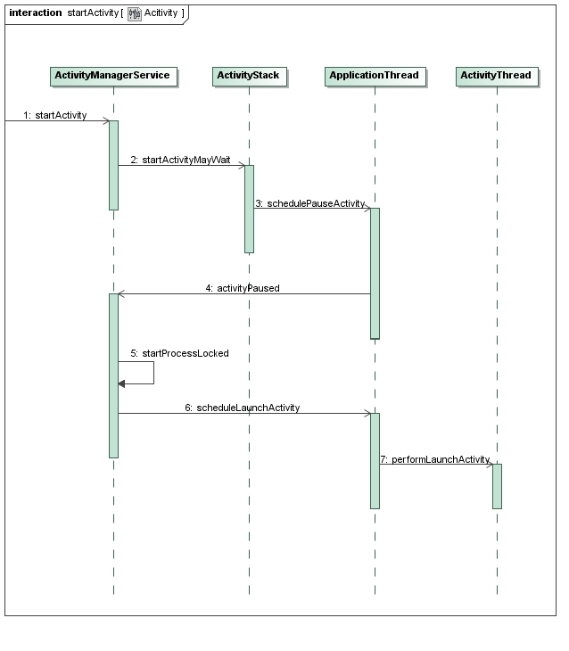

# Android应用程序的Activity启动过程 #

&emsp;&emsp;在Android系统中，有两种操作会引发Activity的启动，一种用户点击应用程序图标时，Launcher会为我们启动应用程序的主Activity；应用程序的默认Activity启动起来后，它又可以在内部通过调用startActvity接口启动新的Activity，依此类推，每一个Activity都可以在内部启动新的Activity。通过这种连锁反应，按需启动Activity，从而完成应用程序的功能。

&emsp;&emsp;这里，我们通过一个具体的例子来说明如何启动Android应用程序的Activity。Activity的启动方式有两种，一种是显式的，一种是隐式的，隐式启动可以使得Activity之间的藕合性更加松散，因此，这里只关注隐式启动Activity的方法。

&emsp;&emsp;首先在Android源代码工程的`packages/experimental`目录下创建一个应用程序工程目录Activity。这里，工程名称就是Activity了，它定义了一个路径为`shy.luo.activity`的package，这个例子的源代码主要就是实现在这里了。下面，将会逐一介绍这个package里面的文件。应用程序的默认Activity定义在`src/shy/luo/activity/MainActivity.Java`文件中：

```javascript

package shy.luo.activity;  
  
import shy.luo.activity.R;  
  
import android.app.Activity;  
import android.content.Intent;  
import android.os.Bundle;  
import android.util.Log;  
import android.view.View;  
import android.view.View.OnClickListener;  
import android.widget.Button;  
  
public class MainActivity extends Activity  implements OnClickListener {  
    private final static String LOG_TAG = "shy.luo.activity.MainActivity";  
  
    private Button startButton = null;  
  
    @Override  
    public void onCreate(Bundle savedInstanceState) {  
        super.onCreate(savedInstanceState);  
        setContentView(R.layout.main);  
  
        startButton = (Button)findViewById(R.id.button_start);  
        startButton.setOnClickListener(this);  
  
        Log.i(LOG_TAG, "Main Activity Created.");  
    }  
  
    @Override  
    public void onClick(View v) {  
        if(v.equals(startButton)) {  
            Intent intent = new Intent("shy.luo.activity.subactivity");  
            startActivity(intent);  
        }  
    }  
}  
```

&emsp;&emsp;它的实现很简单，当点击它上面的一个按钮的时候，就会启动另外一个名字为`shy.luo.activity.subactivity`的Actvity。名字为`shy.luo.activity.subactivity`的Actvity实现在`src/shy/luo/activity/SubActivity.java`文件中：

```javascript
package shy.luo.activity;  
  
import android.app.Activity;  
import android.os.Bundle;  
import android.util.Log;  
import android.view.View;  
import android.view.View.OnClickListener;  
import android.widget.Button;  
  
public class SubActivity extends Activity implements OnClickListener {  
    private final static String LOG_TAG = "shy.luo.activity.SubActivity";  
  
    private Button finishButton = null;  
  
    @Override  
    public void onCreate(Bundle savedInstanceState) {  
        super.onCreate(savedInstanceState);  
        setContentView(R.layout.sub);  
  
        finishButton = (Button)findViewById(R.id.button_finish);  
        finishButton.setOnClickListener(this);  
          
        Log.i(LOG_TAG, "Sub Activity Created.");  
    }  
  
    @Override  
    public void onClick(View v) {  
        if(v.equals(finishButton)) {  
            finish();  
        }  
    }  
}  
```

&emsp;&emsp;它的实现也很简单，当点击上面的一个铵钮的时候，就结束自己，回到前面一个Activity中去。

&emsp;&emsp;这里我们可以看到，Android应用程序架构中非常核心的一点：MainActivity不需要知道SubActivity的存在，即它不直接拥有SubActivity的接口，但是它可以通过一个字符串来告诉应用程序框架层，它要启动的Activity的名称是什么，其它的事情就交给应用程序框架层来做，当然，应用程序框架层会根据这个字符串来找到其对应的Activity，然后把它启动起来。这样，就使得Android应用程序中的Activity藕合性很松散，从而使得Android应用程序的模块性程度很高，并且有利于以后程序的维护和更新，对于大型的客户端软件来说，这一点是非常重要的。

&emsp;&emsp;当然，应用程序框架能够根据名字来找到相应的Activity，是需要应用程序本身来配合的，这就是要通过应用程序的配置文件AndroidManifest.xml来实现了：

```xml
<?xml version="1.0" encoding="utf-8"?>  
<manifest xmlns:android="http://schemas.android.com/apk/res/android"  
    package="shy.luo.activity"  
    android:versionCode="1"  
    android:versionName="1.0">  
    <application android:icon="@drawable/icon" android:label="@string/app_name">  
        <activity android:name=".MainActivity"  
              android:label="@string/app_name">  
            <intent-filter>  
                <action android:name="android.intent.action.MAIN" />  
                <category android:name="android.intent.category.LAUNCHER" />  
            </intent-filter>  
        </activity>  
        <activity android:name=".SubActivity"  
                  android:label="@string/sub_activity">  
            <intent-filter>  
                <action android:name="shy.luo.activity.subactivity"/>  
                <category android:name="android.intent.category.DEFAULT"/>  
            </intent-filter>  
        </activity>  
    </application>  
</manifest>  
```

&emsp;&emsp;从这个配置文件中，我们可以看到，MainActivity被配置成了应用程序的默认Activity，即用户在手机屏幕上点击Activity应用程序图标时，Launcher就会默认启动MainActivity这个Activity：

```xml
<activity android:name=".MainActivity"  
      android:label="@string/app_name">  
       <intent-filter>  
        <action android:name="android.intent.action.MAIN" />  
        <category android:name="android.intent.category.LAUNCHER" />  
    </intent-filter>  
</activity>  
```

&emsp;&emsp;这个配置文件也将名字`“shy.luo.activity.subactivity”`和SubActivity关联了起来，因此，应用程序框架层能够根据名字来找到它：
```xml
<activity android:name=".SubActivity"  
      android:label="@string/sub_activity">  
    <intent-filter>  
        <action android:name="shy.luo.activity.subactivity"/>  
        <category android:name="android.intent.category.DEFAULT"/>  
    </intent-filter>  
</activity>  
```

&emsp;&emsp;下面再列出这个应用程序的界面配置文件和字符串文件。
&emsp;&emsp;界面配置文件在res/layout目录中，main.xml文件对应MainActivity的界面：
```xml
<?xml version="1.0" encoding="utf-8"?>  
<LinearLayout xmlns:android="http://schemas.android.com/apk/res/android"  
    android:orientation="vertical"  
    android:layout_width="fill_parent"  
    android:layout_height="fill_parent"   
    android:gravity="center">  
        <Button   
            android:id="@+id/button_start"  
            android:layout_width="wrap_content"  
            android:layout_height="wrap_content"  
            android:gravity="center"  
            android:text="@string/start" >  
        </Button>  
</LinearLayout>  
```
&emsp;&emsp;而sub.xml对应SubActivity的界面：

```xml
<?xml version="1.0" encoding="utf-8"?>  
<LinearLayout xmlns:android="http://schemas.android.com/apk/res/android"  
    android:orientation="vertical"  
    android:layout_width="fill_parent"  
    android:layout_height="fill_parent"   
    android:gravity="center">  
        <Button   
            android:id="@+id/button_finish"  
            android:layout_width="wrap_content"  
            android:layout_height="wrap_content"  
            android:gravity="center"  
            android:text="@string/finish" >  
        </Button>  
</LinearLayout>  
```

&emsp;&emsp;字符串文件位于`res/values/strings.xml`文件中：

```xml
<?xml version="1.0" encoding="utf-8"?>  
<resources>  
    <string name="app_name">Activity</string>  
    <string name="sub_activity">Sub Activity</string>  
    <string name="start">Start sub-activity</string>  
    <string name="finish">Finish activity</string>  
</resources>  
```

&emsp;&emsp;最后，我们还要在工程目录下放置一个编译脚本文件Android.mk：

```bash
LOCAL_PATH:= $(call my-dir)  
include $(CLEAR_VARS)  
  
LOCAL_MODULE_TAGS := optional  
  
LOCAL_SRC_FILES := $(call all-subdir-java-files)  
  
LOCAL_PACKAGE_NAME := Activity  
  
include $(BUILD_PACKAGE)  
```

&emsp;&emsp;执行以下命令进行编译和打包：
```bash
USER-NAME@MACHINE-NAME:~/Android$ mmm packages/experimental/Activity    
USER-NAME@MACHINE-NAME:~/Android$ make snod   
```

  执行以下命令启动模拟器：
```bash
USER-NAME@MACHINE-NAME:~/Android$ emulator 
```

&emsp;&emsp;模拟器启动起，就可以在屏幕上看到Activity应用程序图标了：


&emsp;&emsp;点击Activity这个应用程序图标后，Launcher就会把MainActivity启动起来：


&emsp;&emsp;点击上面的Start sub-activity铵钮，MainActivity内部就会通过startActivity接口来启动SubActivity：

```javascript
Intent intent = new Intent("shy.luo.activity.subactivity");  
startActivity(intent);  
```
&emsp;&emsp;如下图所示：


&emsp;&emsp;无论是通过点击应用程序图标来启动Activity，还是通过Activity内部调用startActivity接口来启动新的Activity，都要借助于应用程序框架层的ActivityManagerService服务进程。我们已经看到，Service也是由ActivityManagerService进程来启动的。在Android应用程序框架层中，ActivityManagerService是一个非常重要的接口，它不但负责启动Activity和Service，还负责管理Activity和Service。

&emsp;&emsp;Android应用程序框架层中的ActivityManagerService启动Activity的过程大致如下图所示：



&emsp;&emsp;在这个图中，ActivityManagerService和ActivityStack位于同一个进程中，而ApplicationThread和ActivityThread位于另一个进程中。其中，ActivityManagerService是负责管理Activity的生命周期的，ActivityManagerService还借助ActivityStack是来把所有的Activity按照后进先出的顺序放在一个堆栈中；对于每一个应用程序来说，都有一个ActivityThread来表示应用程序的主进程，而每一个ActivityThread都包含有一个ApplicationThread实例，它是一个Binder对象，负责和其它进程进行通信。

&emsp;&emsp;下面简要介绍一下启动的过程：

&emsp;&emsp;Step 1. 无论是通过Launcher来启动Activity，还是通过Activity内部调用startActivity接口来启动新的Activity，都通过Binder进程间通信进入到ActivityManagerService进程中，并且调用ActivityManagerService.startActivity接口； 

&emsp;&emsp;Step 2. ActivityManagerService调用ActivityStack.startActivityMayWait来做准备要启动的Activity的相关信息；

&emsp;&emsp;Step 3. ActivityStack通知ApplicationThread要进行Activity启动调度了，这里的ApplicationThread代表的是调用ActivityManagerService.startActivity接口的进程，对于通过点击应用程序图标的情景来说，这个进程就是Launcher了，而对于通过在Activity内部调用startActivity的情景来说，这个进程就是这个Activity所在的进程了；

&emsp;&emsp;Step 4. ApplicationThread不执行真正的启动操作，它通过调用ActivityManagerService.activityPaused接口进入到ActivityManagerService进程中，看看是否需要创建新的进程来启动Activity；

&emsp;&emsp;Step 5. 对于通过点击应用程序图标来启动Activity的情景来说，ActivityManagerService在这一步中，会调用startProcessLocked来创建一个新的进程，而对于通过在Activity内部调用startActivity来启动新的Activity来说，这一步是不需要执行的，因为新的Activity就在原来的Activity所在的进程中进行启动；

&emsp;&emsp;Step 6. ActivityManagerServic调用ApplicationThread.scheduleLaunchActivity接口，通知相应的进程执行启动Activity的操作；

&emsp;&emsp;Step 7. ApplicationThread把这个启动Activity的操作转发给ActivityThread，ActivityThread通过ClassLoader导入相应的Activity类，然后把它启动起来。