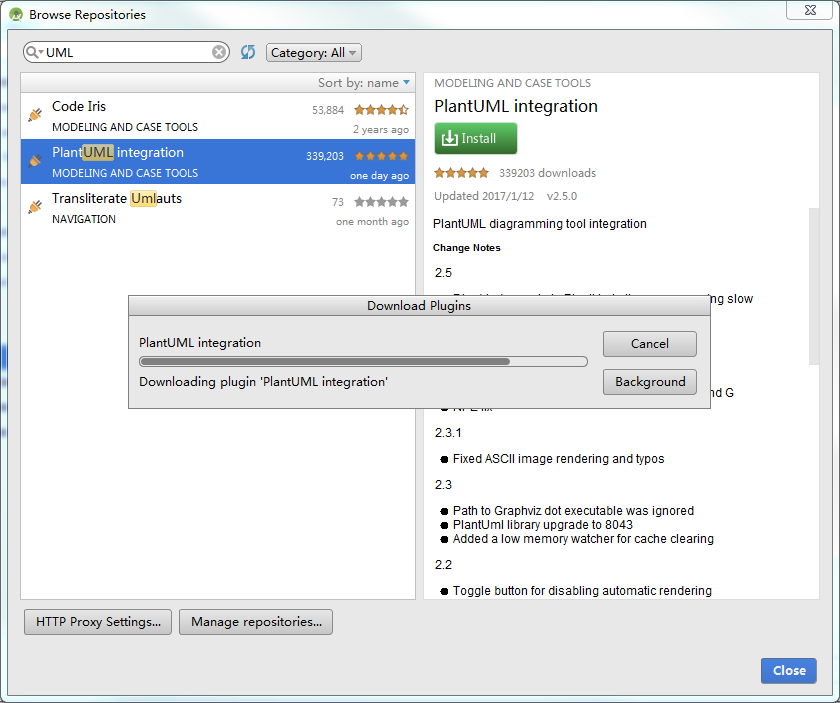
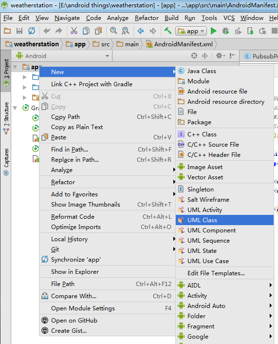
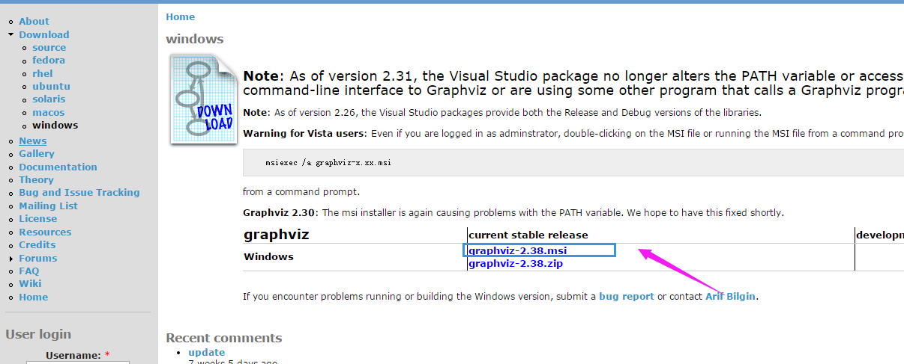
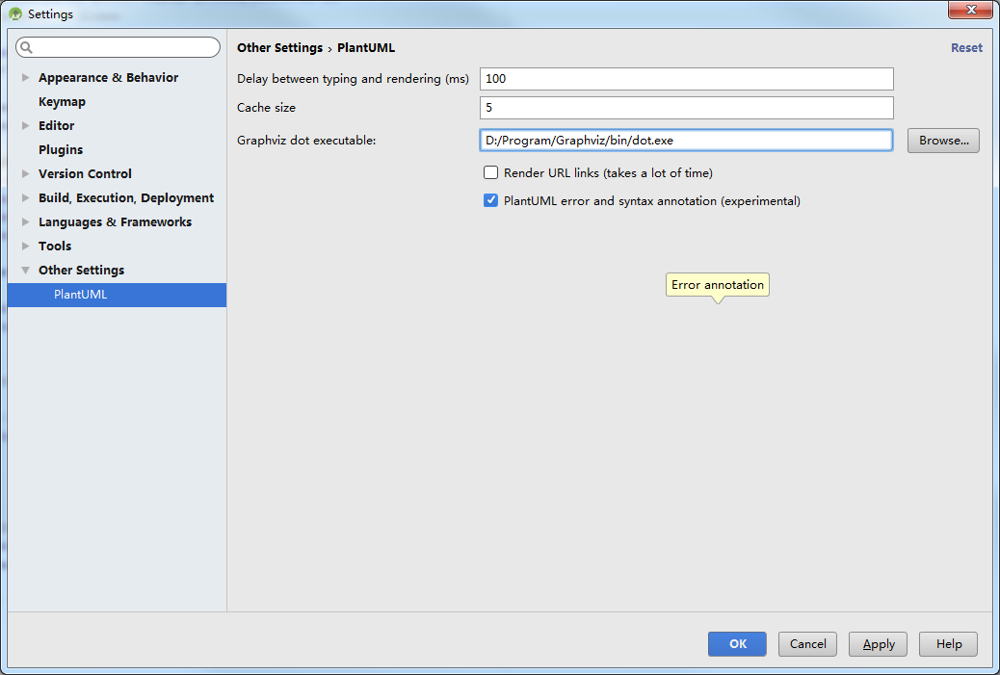

## android studio 中使用plantUML ##

Unified Modeling Language (UML)又称统一建模语言或标准建模语言，用来描述 类（对象的）、对象、关联、职责、行为、接口、用例、包、顺序、协作，以及状态。是帮助自己理清众多类之间复杂关系的不二利器，也能帮助别人快速理解你的设计思路。

那么，我们怎么在AndroidStudio中创建自己的UML类图呢？接下来我就教大家如何用正确的姿势创建UML类图。

### 安装panltUML插件 ###

1.File->Settings->Plugins->Browse repositories
2.在搜索框输入plantUML
3.安装插件

如果以上步骤正确的完成，重启AndroidStudio 工程处右键->new 的时候你会发现多了这么一堆东西，如果出现了这些说明plantUML已经正确的安装了。

### 安装Graphviz ###

1.下载Graphviz
[下载地址](http://www.graphviz.org/Download_windows.php)

2.安装

安装过程我就不详细讲解了，点击next后要记住安装的目录。之后下一步，直到完成就行。

### 设置plantUML ###

1.点击右上角的设置按钮或进入File->Settings->Other Settings ->PlantUML

2.将文件路径填写为刚刚Graphviz的目录下bin目录中dot.exe文件。
`(我的为：D:/Program/Graphviz/bin/dot.exe)`

### 学习使用UML ###

[plantUML快速指南]http://archive.3zso.com/archives/plantuml-quickstart.html#sec-5-4-1

注意，这个教程中的语法和AndroidStudio中基本一致，区别就是开始和结束标志不同。

