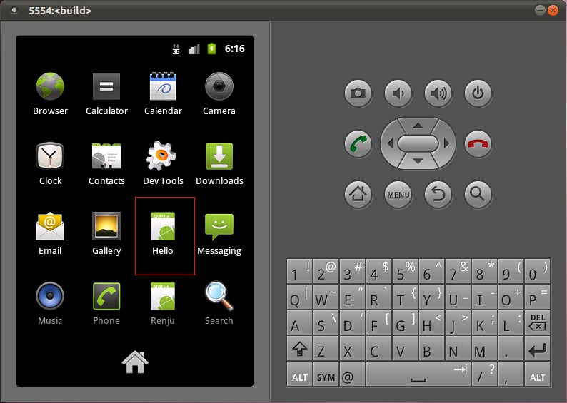
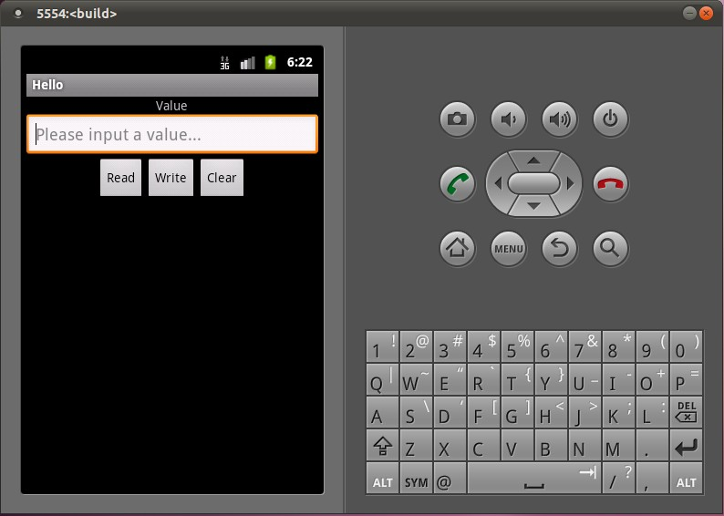

## 在Ubuntu上为Android系统内置Java应用程序测试Application Frameworks层的硬件服务 ##

&nbsp; &nbsp;在Android系统的应用层增加一个内置的应用程序，这个内置的应用程序通过ServiceManager接口获取指定的服务，然后通过这个服务来获得硬件服务。

&nbsp; &nbsp; 一. 在Application Frameworks层定义好自己的硬件服务HelloService，并提供IHelloService接口提供访问服务。

&nbsp; &nbsp; 二. 为了方便开发，我们可以在IDE环境下使用Android SDK来开发Android应用程序。开发完成后，再把程序源代码移植到Android源代码工程目录中。使用Eclipse的Android插件ADT创建Android工程很方便，这里不述，可以参考网上其它资料。工程名称为Hello，下面主例出主要文件：

&nbsp; &nbsp;主程序是`src/shy/luo/hello/Hello.java`：

```java
package shy.luo.hello;  
  
import shy.luo.hello.R;  
import android.app.Activity;  
import android.os.ServiceManager;  
import android.os.Bundle;  
import android.os.IHelloService;  
import android.os.RemoteException;  
import android.util.Log;  
import android.view.View;  
import android.view.View.OnClickListener;  
import android.widget.Button;  
import android.widget.EditText;  
  
public class Hello extends Activity implements OnClickListener {  
    private final static String LOG_TAG = "shy.luo.renju.Hello";  
      
    private IHelloService helloService = null;  
  
    private EditText valueText = null;  
    private Button readButton = null;  
    private Button writeButton = null;  
    private Button clearButton = null;  
      
    /** Called when the activity is first created. */  
    @Override  
    public void onCreate(Bundle savedInstanceState) {  
        super.onCreate(savedInstanceState);  
        setContentView(R.layout.main);  
  
    helloService = IHelloService.Stub.asInterface(  
        ServiceManager.getService("hello"));  
          
        valueText = (EditText)findViewById(R.id.edit_value);  
        readButton = (Button)findViewById(R.id.button_read);  
        writeButton = (Button)findViewById(R.id.button_write);  
        clearButton = (Button)findViewById(R.id.button_clear);  
  
    readButton.setOnClickListener(this);  
    writeButton.setOnClickListener(this);  
    clearButton.setOnClickListener(this);  
          
        Log.i(LOG_TAG, "Hello Activity Created");  
    }  
      
    @Override  
    public void onClick(View v) {  
        if(v.equals(readButton)) {  
        try {  
                int val = helloService.getVal();  
                String text = String.valueOf(val);  
                valueText.setText(text);  
        } catch (RemoteException e) {  
            Log.e(LOG_TAG, "Remote Exception while reading value from device.");  
        }         
        }  
        else if(v.equals(writeButton)) {  
        try {  
                String text = valueText.getText().toString();  
                int val = Integer.parseInt(text);  
            helloService.setVal(val);  
        } catch (RemoteException e) {  
            Log.e(LOG_TAG, "Remote Exception while writing value to device.");  
        }  
        }  
        else if(v.equals(clearButton)) {  
            String text = "";  
            valueText.setText(text);  
        }  
    }  
}  
```

&nbsp;&nbsp;程序通过`ServiceManager.getService("hello")`来获得HelloService，接着通过`IHelloService.Stub.asInterface`函数转换为IHelloService接口。其中，服务名字“hello”是系统启动时加载HelloService时指定的，而IHelloService接口定义在`android.os.IHelloService`中，具体可以参考在Ubuntu上为Android系统的Application Frameworks层增加硬件访问服务一文。这个程序提供了简单的读定自定义硬件有寄存器val的值的功能，通过`IHelloService.getVal`和`IHelloService.setVal`两个接口实现。

&nbsp;&nbsp;界面布局文件'res/layout/main.xml'：

```xml
<?xml version="1.0" encoding="utf-8"?>  
    <LinearLayout xmlns:android="http://schemas.android.com/apk/res/android"  
       android:orientation="vertical"  
       android:layout_width="fill_parent"  
       android:layout_height="fill_parent">  
       <LinearLayout  
          android:layout_width="fill_parent"  
          android:layout_height="wrap_content"  
          android:orientation="vertical"   
          android:gravity="center">  
          <TextView   
             android:layout_width="wrap_content"  
             android:layout_height="wrap_content"   
             android:text="@string/value">  
          </TextView>  
          <EditText   
             android:layout_width="fill_parent"  
             android:layout_height="wrap_content"   
             android:id="@+id/edit_value"  
             android:hint="@string/hint">  
          </EditText>  
       </LinearLayout>  
       <LinearLayout  
          android:layout_width="fill_parent"  
          android:layout_height="wrap_content"  
          android:orientation="horizontal"   
          android:gravity="center">  
          <Button   
             android:id="@+id/button_read"  
             android:layout_width="wrap_content"  
             android:layout_height="wrap_content"  
             android:text="@string/read">  
          </Button>  
          <Button   
             android:id="@+id/button_write"  
             android:layout_width="wrap_content"  
             android:layout_height="wrap_content"  
             android:text="@string/write">  
          </Button>  
          <Button   
             android:id="@+id/button_clear"  
             android:layout_width="wrap_content"  
             android:layout_height="wrap_content"  
             android:text="@string/clear">  
          </Button>  
       </LinearLayout>  
    </LinearLayout>  
```

字符串文件`res/values/strings.xml`：

```xml
<?xml version="1.0" encoding="utf-8"?>  
    <resources>  
       <string name="app_name">Hello</string>  
       <string name="value">Value</string>  
       <string name="hint">Please input a value...</string>  
       <string name="read">Read</string>  
       <string name="write">Write</string>  
       <string name="clear">Clear</string>  
    </resources>  
```

程序描述文件`AndroidManifest.xml`：
```xml
<?xml version="1.0" encoding="utf-8"?>  
    <manifest xmlns:android="http://schemas.android.com/apk/res/android"  
      package="shy.luo.hello"  
      android:versionCode="1"  
      android:versionName="1.0">  
      <application android:icon="@drawable/icon" android:label="@string/app_name">  
        <activity android:name=".Hello"  
                  android:label="@string/app_name">  
            <intent-filter>  
                <action android:name="android.intent.action.MAIN" />  
                <category android:name="android.intent.category.LAUNCHER" />  
            </intent-filter>  
        </activity>  
      </application>  
    </manifest>   
```

&nbsp;&nbsp;三. 将Hello目录拷贝至`packages/experimental`目录，新增`Android.mk`文件：
```bash
USER-NAME@MACHINE-NAME:~/Android/packages/experimental$ vi Android.mk
​```bash

​```bash
LOCAL_PATH:= $(call my-dir)
include $(CLEAR_VARS)
LOCAL_MODULE_TAGS := optional
LOCAL_SRC_FILES := $(call all-subdir-java-files)
LOCAL_PACKAGE_NAME := Hello
include $(BUILD_PACKAGE)
```

&nbsp;&nbsp;四. 编译：
```bash
USER-NAME@MACHINE-NAME:~/Android$ mmm packages/experimental/Hello
```
编译成功后，便可以在`out/target/product/generic/system/app`目录下看到`Hello.apk`文件了。

&nbsp;&nbsp;五. 重新打包系统镜像文件system.img：
```bash
USER-NAME@MACHINE-NAME:~/Android$ make snod
```
重新打包后的`system.img`文件就内置了`Hello.apk`文件了。

  六. 运行Android模拟器：
```bash
USER-NAME@MACHINE-NAME:~/Android$ emulator -kernel kernel/common/arch/arm/boot/zImage &
```
在Home Screen中可以看到Hello应用程序：

打开Hello应用程序：

点击Read按钮，可以从HelloService中读取硬件寄存器val的值；点击Clear按钮，可以清空文本框的值；在文本框中输入一个数值，再点击Write按钮，便可以将这个值写入到硬件寄存器val中去，可以再次点击Read按钮来验证是否正确写入了值。